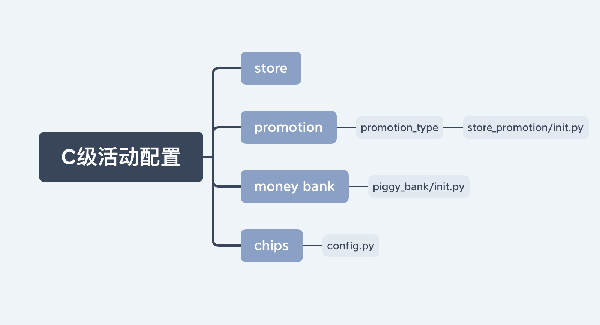

# 博乐工作日志

## 2020-11

### 2020-11-16

入职培训，熟悉工作环境，安装开发软件vscode，熟悉Crash Frency，完成新手教程

### 2020-11-17

学习Python2.7，安装MySQL、MySQL workbench，RDM，熟悉macOS系统

### 2020-11-18

python面向对象部分，异常处理

MySQL连接不上

#### Socket学习

Socket是在应用层和传输层之间的一个抽象层，他把TCP/IP层复杂的操作抽象为几个简单的接口，供应用层调用实现进程在网络中的通信。

Socket保证了不同计算机之间的通信，也就是网络通信。对于网站，通信模型是服务器与客户端之间的通信。两端都建立了一个Socket对象，然后通过Socket对象进行传输。通常服务器处于一个无限循环，等待客户端的连接。

### 2020-11-19

当前任务
/sharetoall/10/Phoenix Studio/Casino System/System Module/01_更新计划/2020.11.24

python学习
元组元素不可修改，但是内存占用和效率要优于list

jupyter打开报错
使用`LANG=zn jupyter notebook`

阿里云桌面添加ssh并git代码，[参考网址](https://blog.csdn.net/Suo_ivy/article/details/79940839)

```
ssh-agent bash
ssh-add ~/.ssh/jiangchenrui
ssh -T git@10.10.10.228
```

[SQL索引](https://www.cnblogs.com/hyd1213126/p/5828937.html)

### 2020-11-20

阅读login.py代码
hasattr(object, name)用于判断objec是否有name属性
[python协程](https://mydevops.github.io/2017/03/18/Python-2-Python-%E5%8D%8F%E7%A8%8B/)

@classmethod
在类例定义可以不实例化类就可以直接调用
```
class A(object):
    num = "类属性"
    
    def func1(self):
        print 'func1'
        print self
        
    @classmethod
    def func2(cls):
        print 'func2'
        print cls
        print cls.num
        cls().func1()

        
A.func2()
```

### 2020-11-23

* 先把ssh私钥文件（以rsa为例)放到云桌面的.ssh文件夹下
* 在.ssh文件下创建config文件，写入如下内容
```
Host *
    HostName [服务器]
    PreferredAuthentications publickey
    IdentityFile ~/.ssh/rsa
    User jiangchenrui
```
阅读d级活动代码

设计模式六大原则

* 开闭原则
* 里氏代换原则
* 依赖倒转原则
* 接口隔离原则
* 迪米特法则（最少知道原则）
* 合成复用原则

### 2020-11-24

明确rocket修改目标

重构inbox，发送礼物有过期失效问题

### 2020-11-25

[python代码优化](https://xzhren.github.io/posts/2016/2016-08-22-[%E4%BB%96%E5%B1%B1%E4%B9%8B%E7%9F%B3]-1-Python-%E4%BB%A3%E7%A0%81%E6%80%A7%E8%83%BD%E4%BC%98%E5%8C%96%E6%8A%80%E5%B7%A7.html)

[python输入](https://www.jianshu.com/p/ba55536e0a39)

```python
# python循环输入多行多列
import sys
def __name__ == '__main__':
    inputList = []
    while True:
        item = sys.stdin.readline().strip()
        if item == '':
            break
        item = list(item.split())
        inputList.append(item)
    print(inputList)
```

### 2020-11-26

优化indox的log，配置B级活动rocket

### 2020-11-27

完成rocket阶段奖励配置

### 2020-11-30

rocket修改公会任务配置和关卡配置

### 2020-12-03

inbox collect_gift_coin优化，将所有if-elif分开，放到一个大字典中，下一步优化：将收奖分为三步，第一获取v1和v2，第二，第三更新返回值

### 2020-12-04

使用跳板机连接测试服

```
ssh-add .ssh/jiangchenrui_p.pem

screen -r s03
```
ctrl+a+d退出当前命令行，继续执行

使用less查看日志

## [git操作](https://www.ruanyifeng.com/blog/2015/12/git-cheat-sheet.html)

查看项目所用分支：
```
git branch -a
```

删除本地分支:
```
git branch -d <BranchName>
```

删除远程分支
```
git push origin --delete<BranchName>
```

### 2020-12-07

部署bingo并测试代码，修改inbox代码

### 2020-12-08

inbox代码调用修改

### 2020-12-09

inbox分支测试，import导入模块有错误，原因为activity导入inbox模块，inbox使用的collect又调用activity，以及旧方法导入不正确导致的。

### 2020-12-10

[数据库事务ACID特性](https://blog.csdn.net/u012440687/article/details/52116108)\

* 原子性(Atomicity)
    事务是一个不可再分割的工作单元
* 一致性(Consisitency)
    事务开始之前和事务结束以后，数据库的完整性约束没有被破坏
* 隔离性(Isolation)
    多个事务并发访问时，事务之间是隔离的
* 持久性(Durability)
    事务完成后对数据库所作的更改便持久的保存在数据库中


[设计模式](https://www.zhihu.com/question/308850392)

### 2020-12-11

atw活动，scheduler部署，journey活动需要加atw的5选1

### 2020-12-14

[实例方法、类方法和静态方法的区别](https://blog.csdn.net/lihao21/article/details/79762681)

类方法的作用：
    1. 定义多个构造函数
    2. 继承类有区别（子类覆盖父类的静态方法，子类的实例调用静态方法为父类，调用类方法为子类)

### 2020-12-15

完成12-22的cash journey活动

### 2020-12-16

完成网站修改journey骰子数，cash journey的booster添加5选1功能

### 2020-12-17

完善inbox，解决冲突和合并主分支代码，测试inbox发奖，完成23019活动，活动需要添加wild_bag点数

### 2020-12-18



### 2020-12-21

完成cooking配置修改

### 2020-12-22

修改atw展示点数，按价格最低值返回

### 2020-12-23

列表、元组、字典、集合、字符串都为可迭代对象，可以使用isinstance(obj, Iterable)判断obj是否为可迭代对象
[yield使用](https://liam.page/2017/06/30/understanding-yield-in-python/)

### 2020-12-24

journey上线

### 2020-12-25

cooking奖励修改，python 130题

### 2020-12-28

atw代码阅读，完成1-5atw活动

### 2020-12-29